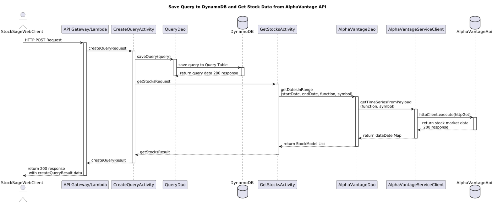
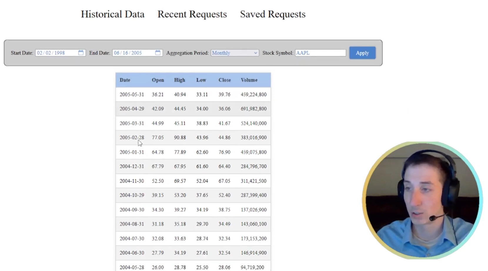
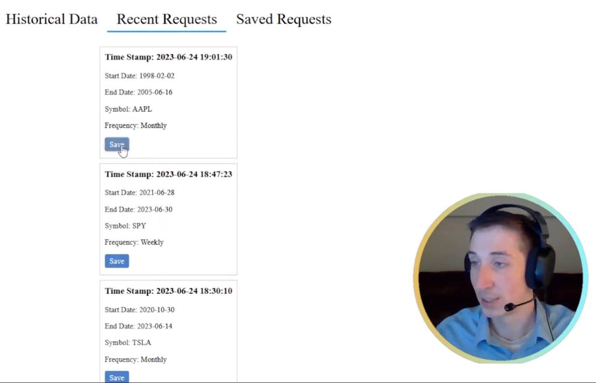
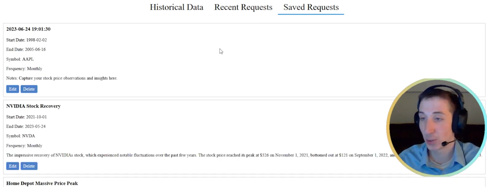
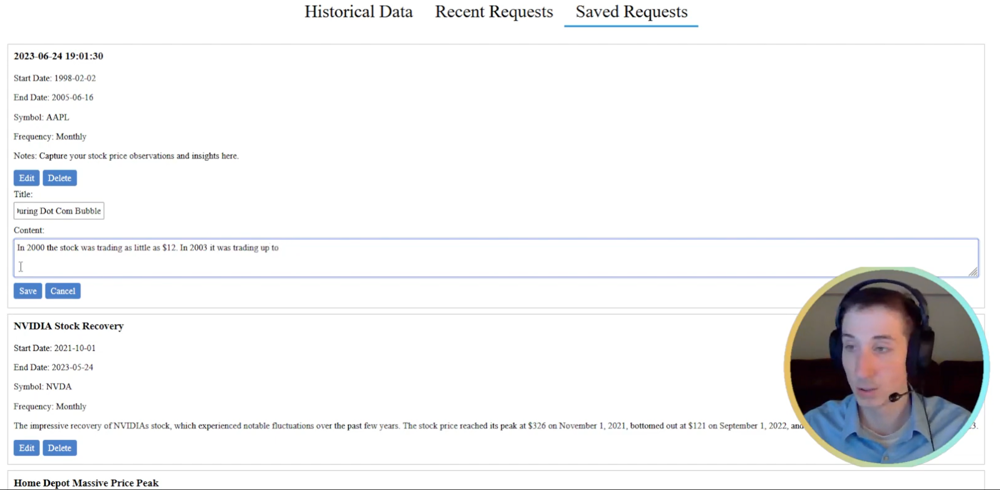

# Stock Sage

## Overview

Stock Sage is a dashboard for investors to access historical pricing data using AlphaAdvantage’s public API. 
Investors may save recent queries to track historical moments. For each query, an investor may add a title and description to document their thoughts.

## Technologies

### Frontend

JavaScript, HTML, CSS, Webpack, AXIOS

### Backend

Java, AWS Lambda, DynamoDB

### AlphaVantage API
[AlphaVantage](https://www.alphavantage.co/#about) provides real-time and historical financial market data through a set of powerful and developer-friendly data APIs and spreadsheets.

## API Data Modeling

#### Query Model (DynamoDB)

    - String username; (Primary Key)
    - String queryId; (Sort Key)
    - String dateRequested;
    - String startDate;
    - String endDate;
    - String frequency;
    - String symbol;
    - String saved; 
    - String title;
    - String content;

#### Stock Model (AlphaVantageAPI)

AlphaVantages Free API provides the following key stock metrics:

- Open
- Highs
- Lows
- Close
- Volume

## Sequence Diagram

_Image 1: Sequence Diagram for Stock Sage's Primary Use Case: **Create Query**_

## Website Pictures

These pictures come from a [video demonstration](https://www.youtube.com/watch?v=rZTtFd0rAr0) of the Stock Sage's web application.

_Image 2: Generating a Query to analyze Apple's stock price from 1998 to 2005._

_Image 3: Review and save recent requests sorted by timestamp._

_Image 3: Review saved requests to take notes._

_Image 4: Editing title and description for Apple's stock data query._
